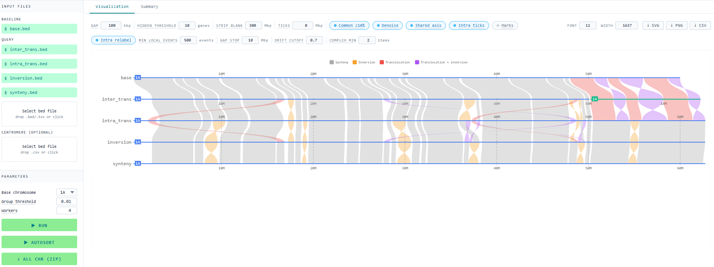

# gene-visualizer

[](https://codecov.io/gh/biometryhub/gene-visualisation)

React app for visualizing genomic synteny graph from BED files. It loads a base BED and one or more query BEDs,
joins rows by id, classifies each row as synteny / inversion / translocation, groups contiguous rows into
chunks, and draws ribbons between chromosome bars.

Download the standalone HTML from the [latest release](https://github.com/biometryhub/gene-visualisation/releases/latest).

## Scripts

- `yarn dev`: start the dev server (craco)
- `yarn build`: production build to `build/`
- `yarn build-one`: a standalone HTML in `dist/` (Python helper required)
- `yarn test`: run the Jest suite (append `--coverage` for a coverage report)

## Example data

`examples/` holds a synthetic BED files: `base.bed` and four query files. Running the app with all bed files
selected with defaults parameters should result in a figure similar to screenshot below.



`examples.zip` containing these files is also provided with each release.

## `yarn build-one` prerequisites

`build-one` runs `./touch-up.py` between the CRA build and the webpack inlining step. The script's shebang is
`#!./env/bin/python`, so a virtualenv must exist at `./env`. One-time setup:

```sh
python3 -m venv env
env/bin/pip install -r requirements.txt
```

After that, `yarn build-one` should work.

## Tech

React 18, TypeScript, CRA via craco, @visx for SVG primitives, zustand for
state, fflate for zipped exports, web workers for BED parsing.
