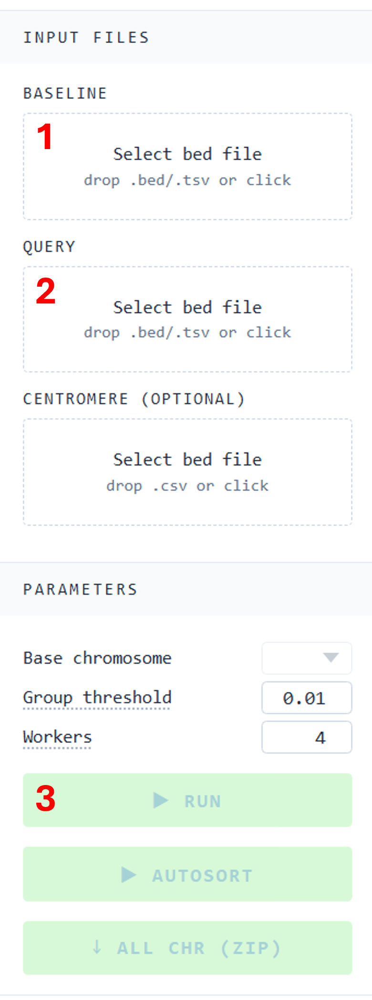

# gene-visualizer

[](https://codecov.io/gh/biometryhub/gene-visualisation)

React app for visualizing genomic synteny graph from BED files. It loads a base BED and one or more query BEDs,
joins rows by id, classifies each row as synteny/inversion/translocation, groups contiguous rows into chunks,
and draws ribbons between chromosome bars.

## Quick start

To use the app, download `gene-visualizer-v*.html` from the [latest release][release] and open it in a browser.

### Example

To make your first synteny graph with the sample data downloaded from [`examples/`][examples] (or `example.zip`
in [release][release]),

1.  Select `base.bed` as a baseline. 
2.  Select the remaining 4 BED files as query.
3.  Click `RUN` with default parameters.



The result should be similar to the figure below.

![Visualization tab with the example bed files loaded][ss]

## Scripts

- `yarn dev`: start the dev server (craco)
- `yarn build`: production build to `build/`
- `yarn build-one`: a standalone HTML in `dist/` (Python helper required)
- `yarn test`: run the Jest suite (append `--coverage` for a coverage report)

## `yarn build-one` prerequisites

`build-one` runs `./touch-up.py` between the CRA build and the webpack inlining step. The script's shebang is
`#!./env/bin/python`, so a virtualenv must exist at `./env`. One-time setup:

```sh
python3 -m venv env
env/bin/pip install -r requirements.txt
```

After that, `yarn build-one` should work.

## Tech

React 18, TypeScript, CRA via craco, @visx for SVG primitives, zustand for
state, fflate for zipped exports, web workers for BED parsing.

<!-- internal -->

[examples]: ./examples/
[ss]: ./docs/example.png

<!-- external -->

[release]: https://github.com/biometryhub/gene-visualisation/releases/latest
